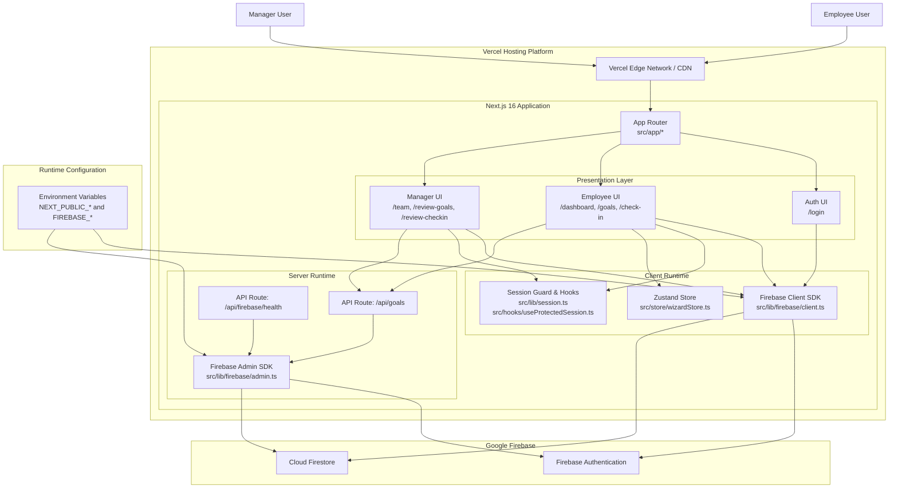

# Project Submission Document

## 1) Working Link (Dummy)
- https://align-portal-new.vercel.app/

## 2) Source Code Repository (Dummy)
- https://github.com/Krishna009-pro/align-portal-new

## 3) Architecture Diagram

## Notes
- This is a single consolidated document as requested.
- Links are intentionally dummy placeholders.
